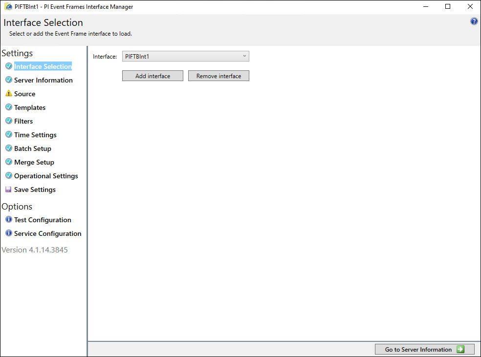

# Configuration

Following interface installation, you must create an interface instance and configure each of its settings before you can begin data collection.

You can configure your interface instance using **PI Event Frames Interface Manager**. This tool allows you to configure each interface setting from an individual tab.

You can open **PI Event Frames Interface Manager** from the **Start** menu. Select **Start > All Programs > PI System > PI Event Frames Interface Manager**.

**PI Event Frames Interface Manager**

## Configuration Overview

This overview provides a high-level outline of each setting that you must configure during the instance configuration process.

1. <xref:BIF_InterfaceSelectionTab>

    Use the **Interface Selection** tab to create a new instance of the [!include[interface](../includes/product-short.md)]. Interfaces are modular, letting you configure multiple interfaces one a single system. You can also create multiple instances of each interface.

1. <xref:BIF_ServerInformationTab>

    Use the **Server Information** tab to choose which PI Data server that you want to use with your interface. If you want to create event frames within PI Asset Framework, you will configure that here as well.

1. <xref:BIF_SourceTab>

    Use the **Source** tab to configure the data source for your interface. You can configure your [!include[interface](../includes/product-short.md)] instance to read from one or more data sources. Reading from multiple data sources lets you handle distributed batch processing scenarios, where multiple batch execution systems cooperate in the manufacturing of a single batch.

1. <xref:BIF_TemplatesTab>

1. <xref:BIF_FiltersTab>

1. <xref:BIF_TimeSettingsTab>

1. <xref:BIF_BatchSetupTab>

1. <xref:BIF_MergeSetupTab>

1. <xref:BIF_OperationalSettingsTab>
