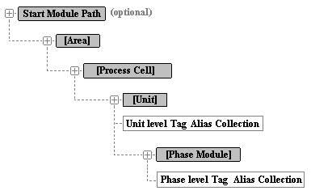

# Equipment hierarchy

<!-- Static topic. No modifications usually required -->

When recording batch data from the data source in the PI Batch Database, the interface creates PI modules or PI AF elements representing equipment, according to the data from the data source. The following equipment hierarchy is created:

By default, the hierarchy is located at the root level of the PI Module Database or the PI AF element hierarchy. To specify a different root, use PI Event Frame Interface Manager to configure the start module path.

Aliases associate unit with PI tags that track measurements of interest that are related to the unit, for example, temperature. By default, aliases are created at the unit and phase module level. Unit aliases are created for a tag if the template includes the **UNIT** placeholder, and phase aliases are created if it contains the **PHASEMODULE** placeholder. Unit aliases are also created if the tag name contains the unit name (for example, if the unit name is UNIT202 and the tag name is "UNIT202 report tag"), a unit alias is created; likewise for phase modules. All batch interfaces support unit- and phase-level aliases, and some support creation of aliases at any level of the batch hierarchy. For details, refer to the interface-specific section of this guide.
