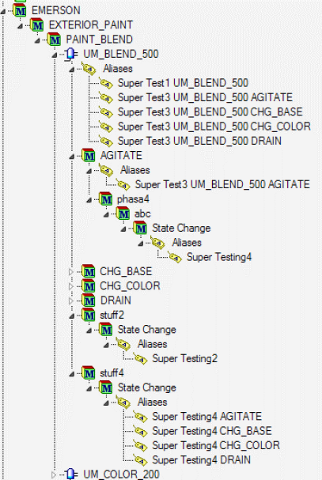

# Tag template examples

Capture report events for phase modules.

## Tag template:

```
Tag[1].Name =[Unit] [phasemodule] [Event, value="Report"] 
Tag[1].Value =[Descript]:[Pval]:[EU]-[Event]_Just for testing 
Tag[1].Type = string 
Tag[1].unitalias=[phasemodule] Report 
Tag[1].phasealias=Report 
Tag[1].Annotation=[BatchID]
```

## Incoming data:
```
[BatchID]=Batch_123 
[Time]=08/12/2008 13:00:05.123 
[Descript]= Level 
[Pval]=123.456 
[EU]=cm 
[Event]=Report 
[Unit]=U101 
[PhaseModule]=PDL123
```

Resulting PI point: U101 PDL123 Report

Resulting event added to PI point:
* Timestamp: 08/12/2008 13:00:05.123
* Value: Level:123.456:cm-Report_Just for Testing
* Annotation: Batch_123

The MDB module or PI AF asset for this phase module will have an alias that refers to this point: Multiple triggers for same tag

## Tag template:
```
Tag[1].Name = [Unit] Tester 
Tag[1].Value =[pval]-[Event] 
Tag[1].Type = string 
Tag[1].Trigger = [Event, value="Report"] 
Tag[1].Trigger = [Event, value="State Change"] 
Tag[1].Trigger = Comment 
Tag[1].unitalias = Testing [Unit] 
Tag[1].phasealias = Testing phase alias
```

## Incoming data:
```
Event 1: [Time]=08/12/2008 13:00:05.123 [Event]=Report [Unit]=U101 [Pval]=123.456 
Event 2: [Time]=08/12/2008 15:20:01.998 [Event]=State Change [Unit]=U101 [Pval]=HOLDING 
Event 3: [Time]=08/12/2008 18:49:12.020 [Event]=Comment [Unit]=U101 [Pval]=Discard Product
```
Resulting PI point: U101 Tester

Resulting event added to PI point

| TimeStamp | Value (string) |
| --------- | -------------- |
| 08/12/2008 13:00:05.123 | 123.456-Report |
| 08/12/2008 15:20:01.998 | HOLDING-State Change |
| 08/12/2008 18:49:12.020 | Discard Product-Comment |

## Recording start and stop events

The following tag templates store 1 when an operation or phase starts and 0 when it ends.
```
Tag[1].Name = Activity on [Unit] [Pval] 
Tag[1].Value = 1 
Tag[1].Type = integer 
Tag[1].Trigger = [Descript, value="Step Activated"] [Event, value="Step Activity] [EU, value="Operation"] 
Tag[1].Trigger = [Descript, value="Step Activated"] [Event, value="Step Activity] [EU, value="Phase"] 
Tag[2].Name = Activity on [Unit] [Pval] 
Tag[2].Value = 0 Tag[2].Type = integer 
Tag[2].Trigger = [Descript, value="Step Deactivated"] [Event, value="Step Activity] [EU, value="Operation"] 
Tag[2].Trigger = [Descript, value="Step Deactivated"] [Event, value="Step Activity] [EU, value="Phase"]
```
## Tag aliasing

The following tag templates create tags corresponding to the aliases shown in the figure below.
```
Tag[1].Name = Super Test1 [Unit] 
Tag[1].Value = [Event] | [Pval] 
Tag[1].Trigger = [Event,value=State Change] 
Tag[2].Name = Super Test2 [Unit] 
Tag[2].Value = [Event] | [Pval] 
Tag[2].Trigger = [Event,value=State Change] 
Tag[2].UnitAlias = stuff2\[Event] | Super Testing2 
Tag[3].Name = Super Test3 [Unit] [PhaseModule] 
Tag[3].Value = [Event] | [Pval] 
Tag[3].Trigger = [Event,value=State Change] 
Tag[4].Name = Super Test4 [Unit] [PhaseModule] 
Tag[4].Value = [Event] | [Pval] 
Tag[4].Trigger = [Event,value=State Change] 
Tag[4].UnitAlias = stuff4\[Event] | Super Testing4 [PhaseModule] 
Tag[4].PhaseAlias = phasa4\abc\[Event] | Super Testing4 
Tag[5].Name = Super Test5 [Unit] [PhaseModule] 
Tag[5].Value = [Event] | [Pval] 
Tag[5].Trigger = [Event,value=State Change] Tag[5].UnitAlias = NONE 
Tag[5].PhaseAlias = NONE
```
