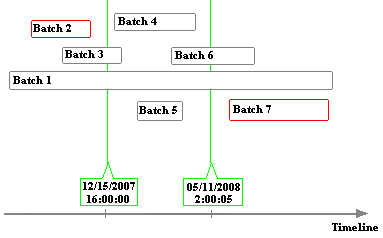

# Interface modes

<!-- Static topic. No modifications usually required -->

PI Interfaces for Batch and Manufacturing Execution Systems can be run in five different modes:

* RealTime (default)
* Recovery
* Preprocess
* Statistics
* Delete

## RealTime mode

In **RealTime** mode, the interface monitors the data source for events that indicate the start or end of a batch or any child level thereof, recording these events in the PI System according to your batch configuration. The interface records newly-acquired data at the end of each scan regardless of whether batches are completed on the source. At startup, before it begins real-time data collection, the interfaces
attempts to recover any data written after it was shut down.

## Recovery mode

To recover events that occurred during interface downtime, the interface scans the data source for a specified period. If you omit an end time or specify `*` (current time), the interface recovers data and then starts collecting data in **RealTime** mode. If you specify an end time, the interface recovers data for the specified period and then exits. To ensure that history is recovered as completely as possibly, specify an end time of `*` (current time).

In recovery mode, the interface reads batch data from the data source for the specified time period. This mode can be used to initialize the PI System with historical data from the data source. If batch data for the specified period already exists in the PI System and the interface detects discrepancies, it attempts to correct the PI System data, logging any errors.

For example, the following figure shows a data source that contains batch data for seven batches.

If you recover data for the period from 12/15/2007 16:00:00 through 05/11/2008 2:00:05, the interface recovers contained batches (Batch 4 and 5) as well as border batches (Batch 1, Batch 3 and Batch 6). Batches outside the time frame (Batch 2 and 7) are not recovered.

## Preprocess mode

If your data source contains data with timestamps that are earlier than the period covered by the primary archive, you can recover events by running the interface in *Preprocess** mode, which scans the data source and creates the required tags, modules and units in the PI System. After running the interface in **Preprocess** mode, you must reprocess older archives to create entries for the tags, modules and units, then run the interface in recovery mode. This process is also referred to as "backfilling". (See the [Backfill existing archives from new PI points](https://livelibrary.osisoft.com/LiveLibrary/content/en/server-v11/GUID-AC6FD05C-272B-416A-B58F-8D7E74955243?_ga=2.17113465.1160372036.1545157080-139070265.1539110441#addHistory=true&filename=GUID-703B22D1-0314-4920-801D-DF7BBDC129F7.xml&docid=GUID-3846AF0C-8A3A-413A-8403-F7652C96EA15&inner_id=&tid=&query=&scope=&resource=&toc=false&eventType=lcContent.loadDocGUID-3846AF0C-8A3A-413A-8403-F7652C96EA15) for details on reprocessing archives.)

**Note:** For version 4 batch interfaces running with PI server version 390 or later, preprocessing is not required before recovering data.

## Statistics mode

In **Statistics** mode, the interface scans a specified period, comparing data from the data source with the corresponding data in the PI Batch database. After comparing data, the interface reports the results and exits. If you omit an end time, the interface scans from the specified start time until the current time. To run the interface in Statistics mode using PI Event Frames Interface Manager, go to the **Operation Settings** tab, choose **Statistics** mode and specify the start and end times for the period to be analyzed. The interface logs results to the specified output file and exits.

## Delete mode

In **Delete** mode the interface will delete batch data from the PI Batch Database or from event frames for a time period specified by start and end times. To run the interface in **Delete** mode using PI Event Frames Interface Manager, go to the **Operation Settings** tab, choose **Delete** mode and specify the start and end times for the period to be
deleted. To delete data through the current time, omit the end time. If you intend to recover events from the data source for a specified time period, consider deleting existing batch data for that time period first.
