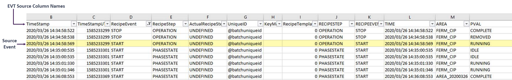

# Placeholders and advanced parsing

Placeholders enable you to incorporate data from incoming events into tag names and data. Placeholders can be used in all types of templates. The precise set of placeholders supported by an interface depends on the data source. The following example illustrates how placeholders correspond to columns in a data source.



When you define templates using the PI Event Frame Interface Manager, you can choose from a list of supported placeholders. To use a placeholder in a field when editing a template, click the **Add Placeholder** button and choose the desired placeholder.

You can define placeholders that read data from PI tags when triggered by batch events. To specify a tag-based placeholder, use the following syntax:

```text
[Tag, Name="PI Tag Name", <comma-delimited list of parameters>]
```

For example:

```text
total:[Tag, name="sinusoid", range="10d", func="TOTAL"]

min:[Tag, name="test_data_1", range="10d", func="MIN"]
```

The following table describes the components of a tag-based placeholder.

| Parameter | Description |
| --------- | ----------- |
| Name="tagname" | (Required) Defines the exact name of the PI tag which should be used for data retrieval. |
| Range="data_range" | (Optional) Defines the time frame for which the data is queried. It can be number of events, time frame or "PIOBJECT". "PIOBJECT" instructs the interface to use the time frame of the related PI batch/unitbatch/subbatch object. Examples: Range="10": Retrieve the ten events that precede the triggered batch event timestamp. Range="10d": Retrieve the events for ten days from the triggered batch event timestamp. Range="PIOBJECT": Retrieve the events between the start and end times of the related batch object.
| Func="option" | (Optional) Used with Range to aggregate retrieved data. Options:<br><br>&bull; "MIN": Minimum value in the time frame.<br>&bull; "MAX": Maximum value in the time frame.<br>&bull; "TOTAL": Sum of values in the time frame.<br>&bull; "MID": Average of values in the time frame. |

Following are wildcards, which you can use to define a mask for template settings and placeholders, to match incoming data and format data to be written to the PI System. 

| Wildcard | Description |
| -------- | ----------- |
| # | Single digit numerical value, 0-9 |
| @ | Single alpha character, a-z, A-Z |
| ? | Any single symbol |
| ! | Repeat the previous mask symbol |
| * | Any set of symbols |

For example, to match any event that starts with "Repo", use the * wildcard as follows: [EVENT, VALUE="Repo*"]. 

The interface supports a set of parameters that provide fine control over how incoming data is parsed. These advanced parsing parameters can be used in all types of templates. To enable you to incorporate these parsing parameters into a placeholder expression, the **Build a Placeholder** dialog provides an **Add Substring Parsing** option.

If you specify parsing parameters for one or more placeholders and no matching data is found, the entry is set to blank. The following table lists the parameters for parsing incoming data. The names of parameters, placeholders, and value substrings are not case-sensitive.

| Parameter | Description |
| --------- | ----------- |
| LBE=ʺsubstringʺ | Defines the left bound of the target substring value. The resulting substring does not include the specified substring. |
| LBI=ʺsubstringʺ |Defines the left bound of the target substring value. The resulting substring includes the specified substring. |
| RBE=ʺsubstringʺ | Defines the right bound of the target substring value. The resulting substring does not include the specified substring. |
| RBI=ʺsubstringʺ | Defines the right bound of the target substring value. The resulting substring includes the specified substring. |
| DELIM=ʺsubstringʺ | Specifies the field separator character or substring. Must be used in conjunction with the COUNT parameter. It narrows the results to the substring contained in delimiters, where the starting delimiter index is specified by the COUNT parameter. To parse the delimited substring, you can specify right and left boundary substrings. |
| COUNT=# | Index (position) of the delimiter from which to start parsing. Must be used in conjunction with the DELIM parameter. |

To search all fields of an incoming event, specify a wildcard for the placeholder name (for example [*,lbe="u:"]).

The following table lists examples of parsing a field that contains the following data:

```text
|U:browntod|C:SP_CHARGE_AMOUNT|O:1200|N:1123|E:kg|M:Local
```

| Example | Resulting Data |
| ------- | -------------- |
| [value, lbe=ʺN:ʺ] | 1123|E:kg|M:Local |
| [value, lbi=ʺN:ʺ] | N:1123|E:kg|M:Local
| [value, rbe=ʺtodʺ] | |U:brown |
| [value, rbi=ʺtodʺ] | U:browntod |
| [value, lbe=ʺU:ʺ, rbe=ʺ|ʺ] | Browntod |
| [value, lbi=ʺU:ʺ, rbe=ʺ|ʺ] | U:browntod |
| [value, lbe=ʺO:ʺ, rbi=ʺkgʺ] | 1200|N:1123|E:kg |
| [value, delim=ʺ|ʺ,count=3] O:1200 |
| [value, delim=ʺ|ʺ,count=3,lbe=ʺO:ʺ] | 1200 |
| [value, delim=ʺ|ʺ,count=3,lbe=ʺC:SPʺ,rbe=ʺUNTʺ] | _CHARGE_AMO |
| [value, delim=ʺ|ʺ,count=6,lbe=ʺM:ʺ] | Local |

## PIEVENT placeholders

These placeholders are supported for expression triggered by PI batch events (Parameter, value="PIEVENT"]).

| Place Holder | Batch Level | How Batch Database is Stored | How Event Frames are Stored |
|--|--|--|--|
| [BATCHID] | 1 or 2 | String value that is stored as PIBatch BatchID and PIUnitBatch BatchID property | Top-level event frame: Name property Second-level event frame: BatchID attribute. |
| [PROCEDURE] | 1 | PIBatch Recipe property | Top level event frame Recipe Attribute |
| [UNITPROCEDURE] | 2 | PIUnitBatch Procedure property | Name property |
| [OPERATION] | 3 | PISubBatch Name property | Name property |
| [PHASE] | 4 | PISubBatch Name property | Name property |
| [PHASESTATE] | 5 | PISubBatch Name property | Name property |
| [PHASESTEP] | 6 | PISubBatch Name property | Name property |
| [UNIT] | n/a | PIModule Name property | PI AF element Name property. |

For example, to update a PI tag when a PI batch is started or ended, specify the following tag templates:

```text
Tag[1].Name=BESName:PIEvent.Batch.Active 
Tag[1].Value=BATCH START: [BATCHID] |Prod: [PRODUCT] |Rec: [PROCEDURE] 
Tag[1].Trigger=[EVENT,value="PIEVENT"] [DESCRIPT, value="BATCH"] [PVAL,value="START"]

Tag[2].Name=BESName:PIEvent.Batch.Active 
Tag[2].Value=BATCH END: [BATCHID] |Prod: [PRODUCT] |Rec: [PROCEDURE] 
Tag[2].Trigger=[EVENT,value="PIEVENT"] [DESCRIPT, value="BATCH"] [PVAL,value="END"]
```
