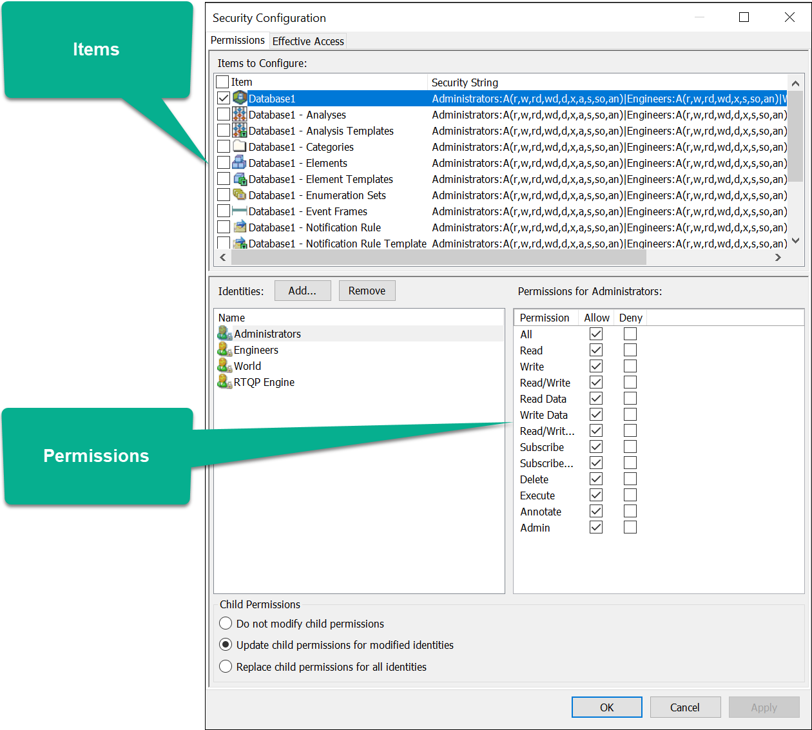

# Configure security for the PI Asset Framework

<!-- Static topic. No modifications usually required -->

If you intend to generate event frames, use **PI System Explorer** configure batch interface security settings for the PI Asset Framework.

1. Open **PI System Explorer**.

1. From the toolbar, click **Database**. 

    **Step result:** The **Select Database** window opens.

1. Right-click the database where you intend to store the batch event frames and select **Security**.

1. From the **Permissions** tab, **Allow** the following permissions for each item listed below:

   Item | Permissions
   -----|------------ 
   Database (the first item listed) | Read/Write
   Categories | Read
   Elements | Read/Write
   Element Templates | Read
   Event Frames | Read/Write

   

1. Click **OK**.
