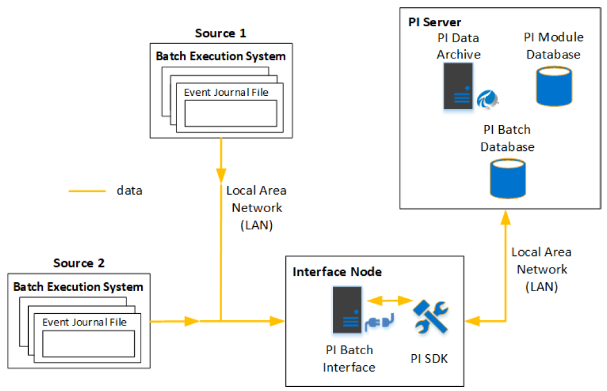

# System Architecture Examples

<!-- Customized for FactoryTalk -->

The following diagrams illustrate various options for configuring batch interfaces, depending on the data source and the desired PI System output.

Data source: event files. Target: PI batch database

Data source: event files. Target: PI AF (event frames and assets)
