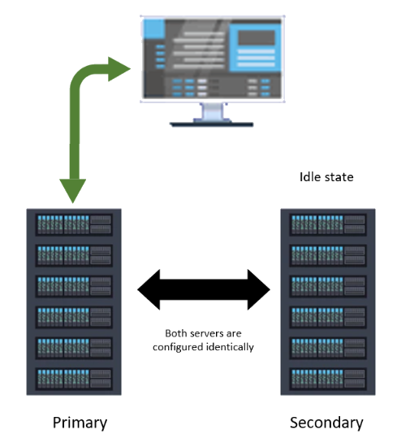
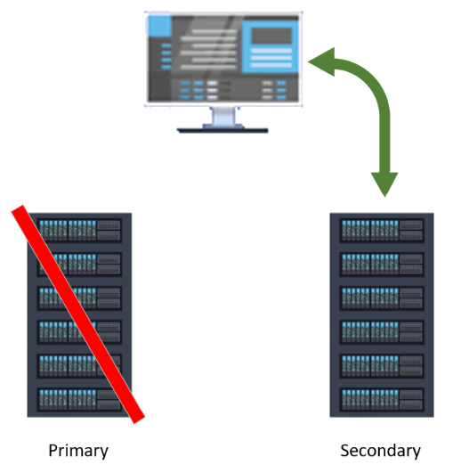
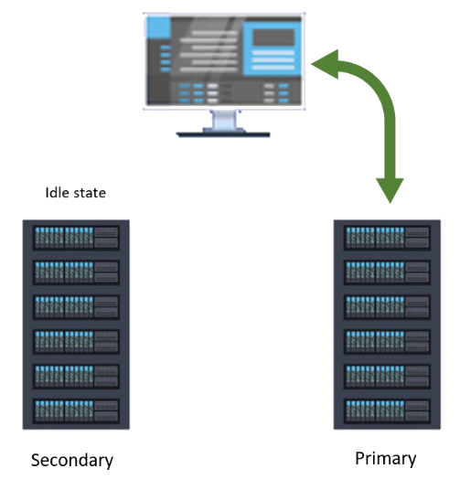

# Batch interface failover

With interface failover, you can configure multiple interface instances for PI Interface for Emerson DeltaV batch to help minimize data loss in case of an unexpected interface machine shutdown. If the primary interface instance fails, then the secondary instance takes over and continues the data collection process. 

For details on configuring failover for the interface, see [Configuring interface instances for failover](/installation-prerequisites/installation-prerequisites/configure-interface-instances-for-failover.md)

The following example illustrates a typical interface failover set-up.

The primary interface updates the failover tag with the timestamp of the last value written.

The secondary interface monitors the failover tag until the primary interface becomes inactive. The secondary instance takes over data collection and becomes the primary when the primary fails and the amount of time it is unavailable without the failover tag being updated exceeds the amount of time configured in the [Failover swap time](/pi-event-frames-interface-manager/operational-settings-tab.md) parameter. 

It is important to note that when the secondary interface takes over the data collection, it does not pick up immediately where the primary stopped. Data is not duplicated. The secondary interface begins data collection based on the value configured in the [Recovery start time (/rst)](/command-line-parameter-reference/command-line-parameter-reference.md) parameter.

When the previously shutdown interface re-establishes connection, it goes into an idle state and become the secondary interface. The interface that was promoted to primary continues regular data collection operation.

