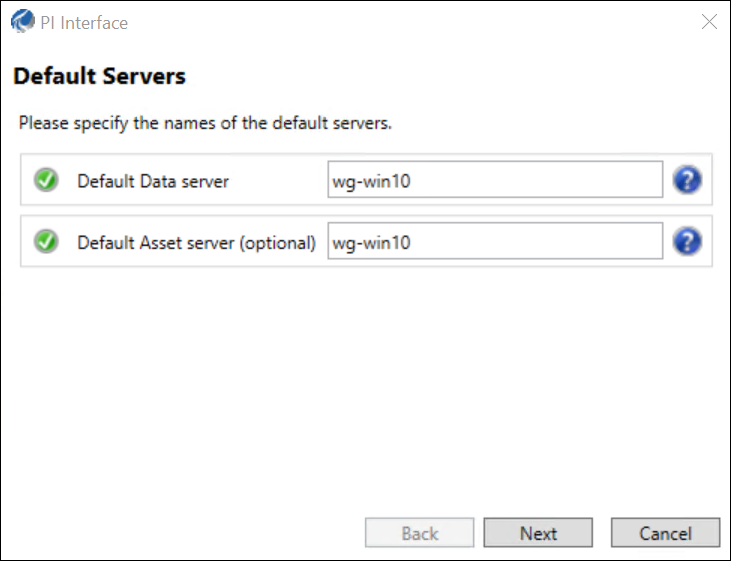

# Installation

After ensuring that the target host and any supporting systems meet the <xref:BIF_SystemRequirements>, download the [!include[interface](../includes/product-short.md)] installer and run it to complete interface installation.

**Note:** If you install the interface on the same host as PI Server, you are not prompted for PI Server host information or installation directories.

1. From the [OSIsoft Customer Portal](https://customers.osisoft.com), download the latest version of the [!include[interface](../includes/product-short.md)] installer.

1. Open the [!include[interface](../includes/product-short.md)] installer. Follow the instructions on screen to complete installation.

1. When prompted, enter the host name for your PI Data Archive and AF Server.

    Field | Server | Required?
    ------|--------|----------
    Default Data server | PI Data Archive | Required
    Default Asset server | AF Server | Optional

    

1. When prompted, either:

    * accept the default installation path
    * choose custom paths

    The installer creates two environment variables used for the installation path:
    
    Environment Variable | Default Path
    ---------------------|-------------
    `PIHOME`             | [!include[path](../includes/product-path.md)]
    `PIHOME64`           | [!include[path64](../includes/product-path-64.md)]

1. Complete the rest of installation as prompted.

**Result:** [!include[interface](../includes/product-short.md)] is installed.