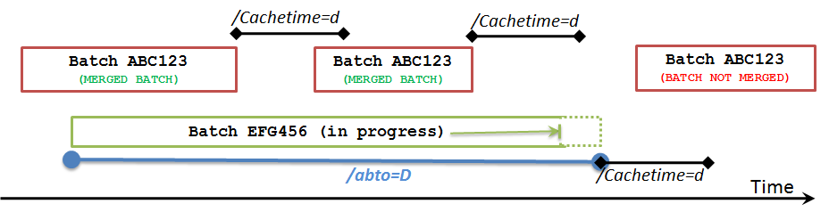

# Time Settings tab 

<!-- Topic requires customization for specific interface -->

You use the **Time Settings** tab to configure the settings that control how the interface handles loss of connectivity and how it processes data.

## Query time settings

### Scan (/SCAN=<seconds>)

Specifies how frequently the interface scans the data source. 

### Cache time (/CACHETIME=<days>)

Specifies how long completed events are retained in memory. Default is one day. Specify the maximum duration expected between events that need to be merged, plus any desired margin of safety. 
The value can be specified as whole day or fraction of a day. For example, to release completed batches when their end time is less than 7 days and 12 hours from current time, specify the following cache time setting:

`CACHETIME=7.5 days`

### Abandoned batch timeout (/ABTO=<days>)

The timeout has 2 functions:

1. In history recovery, if a batch starts less than the recovery start time minus the abandoned batch timeout it is not recovered. For example, if a batch is open in recovery start time, and the start time is June 1, 2019 and we have a 30-day abandoned batch time, and the batch you found is on May 1, 2019, it will not be recovered.

2. In real time mode, if a batch has not received a start or end time in the hierarchy - meaning in the top level of the event frame, or any of the children - and if the last updated time you get is less than the cache time minus the abandoned batch timeout, it will be considered abandoned. If July 1 is real time and cache time is one day, and our abandoned batch timeout is 30 days, and our last start time was April 29, it will be thrown from cache as abandoned.

The following graphic illustrates the timeout logic:

### Maximum query time frame (/MAXQTF=<days>)

To help manage workload and memory usage, defines the maximum time frame for queries. For example, if you specify 30 days and the interface queries for one year's worth of data, the interface issues 12 one-month queries rather than one (large) one-year query.

### Maximum stop time (/MAXSTOPTIME=<seconds>)

Specifies the maximum time allowed for the interface to properly shutdown. If the shutdown process takes longer than the specified time, the interface is forced to terminate immediately. The default value is 120 seconds.

### Use local time stamps to process incoming events (/TS)

Specifies whether timestamps from an SQL data source are interpreted as local time or GMT. By default, timestamps are interpreted as GMT. 

## PI connection settings

### PI connection timeout (/PICONNTO=<seconds>)

Override the default PI SDK Connection TimeOut property.

### PI data access timeout (/PIDATO=<seconds>)

Override the default PI SDK Data Access TimeOut property.

### Retry (/RETRY=<seconds>)

Specifies how often the interface retries failed attempts to write data. The default is 60 seconds.

### Retry timeout (/RETRYTO=<seconds>)

Specifies how long the interface continues retrying an attempt to write data. To avoid data loss, set to 0 (default, no timeout). 

<!--

Mark Bishop 6/21/21: SQL Settings used sometimes

## SQL server connection settings

### SQL connection timeout (/PICONNTO=<seconds>)

Override the default SQL Connection TimeOut property.

### SQL data access timeout (/PIDATO=<seconds>)

Override the default SQL Data Access TimeOut property.  

-->
